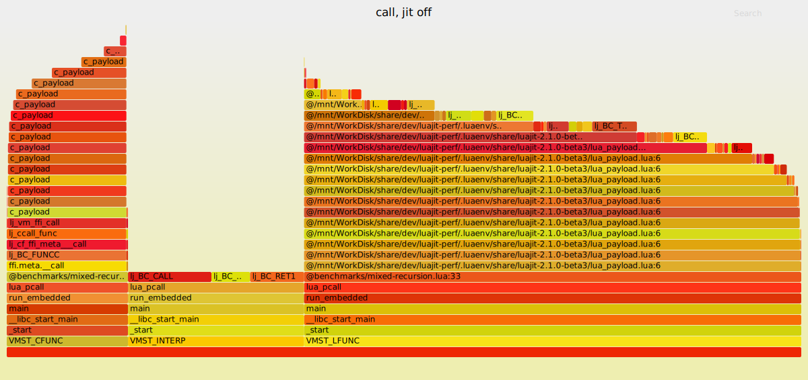

# Simple benchmark



## Usage

```bash
# 0. clone repository
git clone https://github.com/Shishqa/luajit-perf.git
cd luajit-perf
git submodule update --init --recursive

# 1. setup 
./setup.sh  # sudo is needed to install parser

# 2. run benchmark
# here you can add options
# -m [default|leaf|callgraph]     (profiling mode)
# -i <number>                     (profiling interval)
# -j [on|off]                     (jit mode)
# -o <path>                       (output file, default is sysprof.bin)
# -s                              (start profiling immediately)
#
# to turn profiler on during running press Ctrl+C
# to stop execution press Ctrl+\
./run.sh ./benchmarks/mixed-recursion.lua

# 3. visualize results
luajit-parse-sysprof [--split] <binary-file> | flamegraph.pl > flamegraph.svg
```

## TBD

* fix lua dumping segfault
* fix trace callchain dumping
